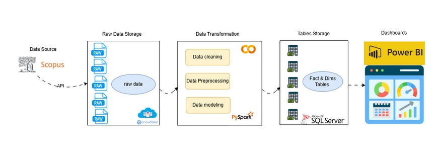
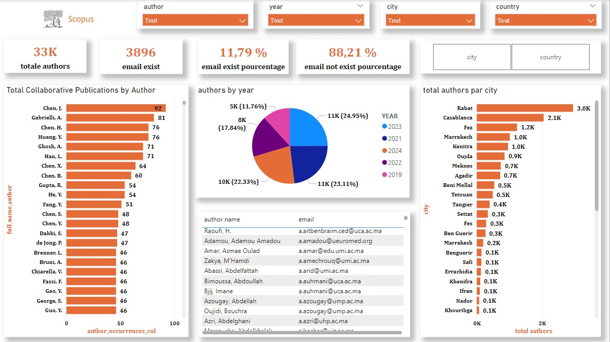

# 📊 **Scopus Data Pipeline and Analytics Dashboard**

## 🚀 **Project Overview**

This project establishes a complete **ETL (Extract, Transform, Load) pipeline** for processing and visualizing data extracted from the **Scopus API**. The pipeline leverages modern tools for efficient data transformation and interactive data visualization using Power BI.

---

## 📐 **Project Architecture**

 <!-- Replace 'path_to_image.png' with the correct image link -->

The pipeline consists of the following stages:

1. **Data Source**  
   - **Scopus API**: Data is extracted via API calls.

2. **Raw Data Storage**  
   - **Snowflake** is used for storing the raw data extracted.

3. **Data Transformation**  
   - **PySpark** is used for:
     - **Data Cleaning**: Removing duplicates and null values.  
     - **Data Preprocessing**: Tokenization, normalization, and filtering.  
     - **Data Modeling**: Creating optimized fact and dimension tables.  

4. **Table Storage**  
   - Fact and dimension tables are stored in **Microsoft SQL Server**.

5. **Data Visualization**  
   - Interactive dashboards are built with **Power BI** for data analysis.

---

## ⭐ **Key Features**

- **Scalable ETL Pipeline**: End-to-end data processing from extraction to visualization.
- **Automated Data Cleaning**: Using PySpark for fast and scalable data preprocessing.
- **Centralized Data Storage**: Data stored in structured tables (fact and dimension) for efficient querying.
- **Interactive Dashboards**: Power BI reports for insightful decision-making.
- **Robust Architecture**: Modular and maintainable code structure.

---

## 📊 **Multi-Dimensional Data Analysis Dashboard - Scopus Data**  

### 🛠️ Project Description  
This project is focused on analyzing and visualizing research data sourced from **Scopus** using a multi-dimensional approach. The dashboard provides comprehensive insights into various aspects of research, such as:  

- 📝 **Authors**  
- 📚 **Publications**  
- 🏛️ **Affiliations**  
- 🌍 **Geographical Distribution**  
- 🖥️ **Web Presence**  
- 🎓 **Conference Participation**  

The data is processed and imported from an **SQL Server** database to ensure efficient handling and scalability.

---

## 📈 **Dashboard Overview**

### 📍 Visualization:  
 <!-- Replace with your dashboard image path -->

---

## 🏷️ **Keywords**  

- 📝 _Author Analysis_  
- 📚 _Publication Trends_  
- 🌍 _Geographical Distribution_  
- 🏛️ _Affiliation Insights_  
- 📊 _Dynamic Dashboards_  
- 🖥️ _Web Presence_  
- 🎓 _Conference Participation_  
- 💾 _SQL Server Integration_  
- 🌟 _Star Schema_

---

## 🌐 **How to Access**  

You can view the live dashboard using the link below:  
👉 **[View the Dashboard](https://app.powerbi.com/view?r=eyJrIjoiMTQwYTFmOTktZTQwMS00ZjQxLWFmNmEtMzNhNGQ2ZDA4YTkxIiwidCI6ImMyNzg3OTIyLTExZDktNGNhOC1hYWRmLTVlZjdmZjMxYTEyNyJ9)**  

---

## 🛠️ **Tools and Technologies**

| **Stage**                 | **Technology**                |
|---------------------------|-------------------------------|
| Data Source               | Scopus API                   |
| Raw Data Storage          | Snowflake                    |
| Data Transformation       | PySpark                      |
| Table Storage             | Microsoft SQL Server         |
| Visualization             | Power BI                     |

---

## ⚙️ **Prerequisites**

Before running the project, ensure you have the following tools installed:

1. **Python 3.8+**
2. **PySpark**
3. **Snowflake Connector**
4. **Microsoft SQL Server**
5. **Power BI Desktop**
